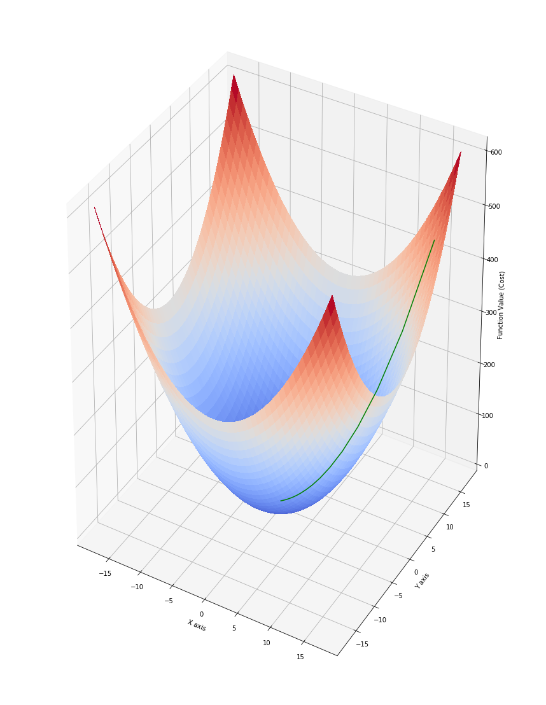
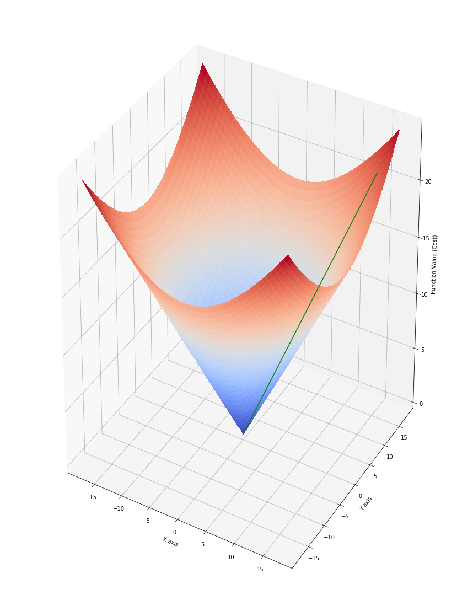
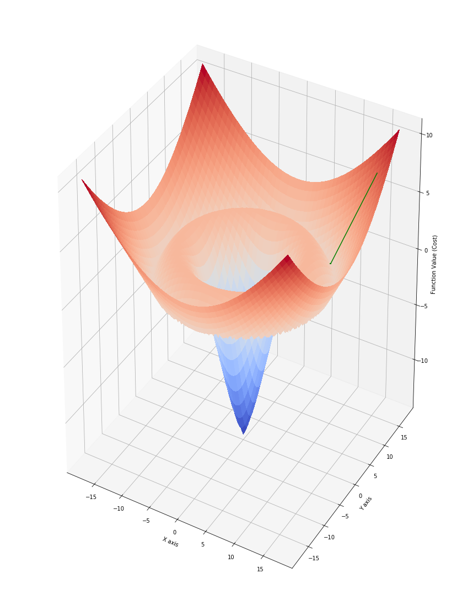
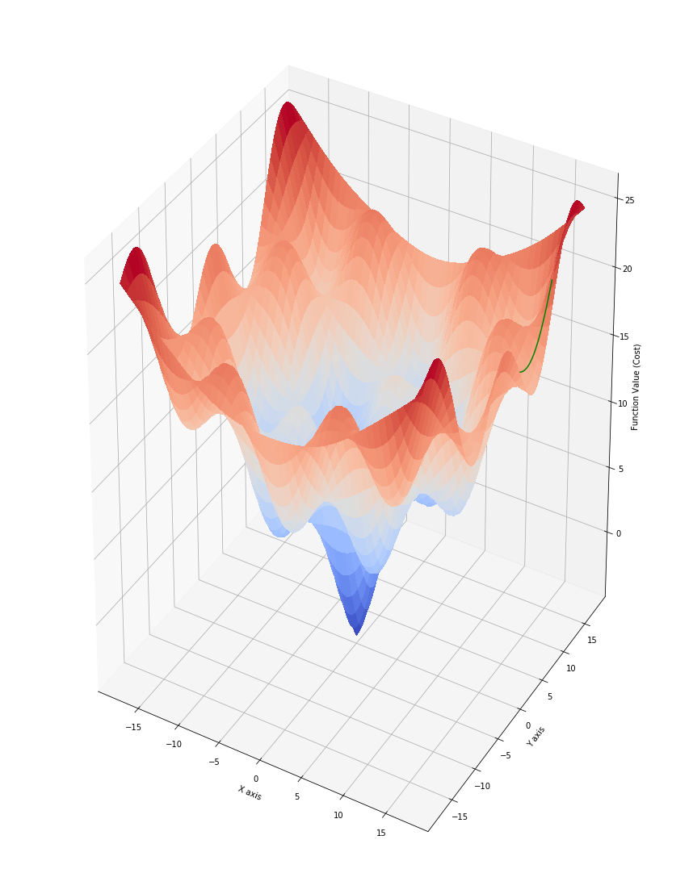
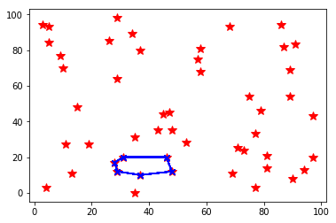

# Metaheuristic_Optimization
This repo consists of 4 parts. In the first part, classical optimazion methods, e.g. random search, gradient descend, and newton-raphson, are implemented and compared on 4 general mathematical functions. Figures 1-4 illustrate the jurney of the gradient descend algorithm on the surfaces of the 4 proposed functions.

_Figure 1: Problem 0_

_Figure 2: Problem 1_

_Figure 3: Problem 2_

_Figure 4: Problem 3_

In the next part, Genetic Algorithm, Differential Evolution, Brute-force, and random search are implemented and compared on the traveling salesmen problem, as an example of NP-hard problems. In this problem, we are looking for a tour through 6 cities with the least cost (i.e. least total distance travelled). Figure 5 is a visualizations of this problem which shows the optimal tour for the chosen random seed.

_Figure 5: The traveling salesman problem_

In part 3, our optimization problems are blackbox problems! With no knowledge of how these functions work, Particle Swarm Optimization is implemented and compared alongside genetic algorithm, grid search, and random search. Lastly, a real-world application of metaheuristic optimization is presented as the final project: **Hyperparameter Optimization for classifiers using Genetic Algorithm**

## **Hyperparameter Optimization for classifiers using Genetic Algorithm**

### Abstract

The performance of most classifiers is highly dependent on the hyperparameters used for training them. Different approaches like grid search or random search are frequently employed to find suitable parameter values for a given dataset. Grid search has the advantage of finding the best solutions at the cost of a much longer run time. Genetic algorithm, on the other hand, can find optimal solutions in a short amount of time, but the accuracy of these solutions is usually a bit lower than those of grid search.

In this study promising start points were provided to a Genetic Algorithm, in order to have more robustness in the results. Experiments were performed for SVM and Random Forest classifiers on 5 datasets. The proposed method achieves almost the same accuracy as grid search at a significantly less amount of time. This approach can be particularly useful when working on large datasets where grid search is not feasible.

### 1. Introduction

Hyperparameter tuning is a very crucial part of designing classifiers. A hyperparameter is a parameter whose value is used to control the learning process, which means if not chosen with careful consideration, it can significantly affect the performance of the model.

The same kind of machine learning model can have different constraints, constants, and learning rates. These measures are called hyperparameters and must be tuned so that the model can optimally solve the machine learning problem. Hyperparameter optimization finds a set of hyperparameters that yields an optimal model which minimizes a predefined loss function on given data[CITATION Cla15 \l 1033]. There are different approaches to perform hyperparameter tuning, and, in this project, we seek to design a novel approach, and compare it against the commonly used Grid Search.

In this study, we will use a modified version of Genetic Algorithm to find an optimal set of hyperparameters for SVM and Random Forest classifiers and compare with Grid search, in both terms of classifier's accuracy and the time needed to find those hyperparameters. We will use different benchmark classification datasets to tune our algorithm, as well as perform the final evaluation.

We will start by materials and methods, going over the datasets used and the concepts of the proposed algorithm. Next, the results are illustrated, followed by the discussion section, which includes interpretations of the results and conclusions.

### 2. Materials and Methods

#### Dataset Analysis

In this project we will work with five classification datasets:

- Spambase dataset
- Banana dataset
- Wine dataset
- Ionosphere Dataset
- Iris Dataset

The first two datasets are used for tuning the algorithm, which includes design procedures and tuning Genetic Algorithm's parameters. The other 3 datasets are left aside for the final evaluation and comparison. Let us review each of them briefly.

##### Spambase Dataset

Table 1 demonstrates the outline of this dataset:

_Table 1_

| Number of classes | 2 |
| --- | --- |
| Total number of samples | 4,597 |
| Number of samples per class | 1,812 (1), 2,785 (0) |
| Number of features | 57 |
| Feature value types | Real |

This database contains information about 4597 email messages. Most of the features indicate whether a particular word or character was frequently occurring in the email. Here are the definitions of the features:

- 48 continuous real attributes of type word\_freq\_"WORD" = percentage of words in the e-mail that match "WORD". A "WORD" in this case is any string of alphanumeric characters bounded by non-alphanumeric characters or end-of-string.
- 6 continuous real attributes of type char\_freq\_"CHAR" = percentage of characters in the e-mail that match "CHAR".
- 1 continuous real attribute of type Capital\_run\_length\_average = average length of uninterrupted sequences of capital letters.
- 1 continuous integer attribute of type Capital\_run\_length\_longest = length of longest uninterrupted sequence of capital letters.
- 1 continuous integer attribute of type Capital\_run\_length\_total = total number of capital letters in the e-mail[CITATION Spambase \l 1033].

Therefore, the dataset would be as described in Figure 1 (next page).

_Figure 1: Spambase dataset_

##### Banana Dataset

Table 2 demonstrates the outline of this dataset:

_Table 2_

| Number of classes | 2 |
| --- | --- |
| Total number of samples | 5,300 |
| Number of samples per class | 2,376 (+1), 2,924 (-1) |
| Number of features | 2 |
| Feature value types | Real |

This is an artificial data set where instances belong to several clusters with a banana shape. There are two attributes At1 and At2 corresponding to the x and y axis, respectively. The class label (-1 and 1) represents one of the two banana shapes in the dataset[CITATION Banana \l 1033].

##### Wine Dataset

Table 3 demonstrates the outline of this dataset:

_Table 3_

| Number of classes | 3 |
| --- | --- |
| Total number of samples | 178 |
| Number of samples per class | 59 (1), 71 (2), 48 (3) |
| Number of features | 13 |
| Feature value types | Real |

This dataset contains the results of a chemical analysis of wines grown in the same region in Italy but derived from three different cultivars. The analysis determined the quantities of 13 constituents found in each of the three types of wines[CITATION Win \l 1033]. Figure 2 describes the dataset in detail.

_Figure 2: Wine Dataset_

##### Ionosphere Data set

Table 4 demonstrates the outline of this dataset:

_Table 4_

| Number of classes | 2 |
| --- | --- |
| Total number of samples | 351 |
| Number of samples per class | 126 (b), 225 (g) |
| Number of features | 34 |
| Feature value types | Integer, Real |

This radar data was collected by a system in Goose Bay, Labrador. This system consists of a phased array of 16 high-frequency antennas with a total transmitted power on the order of 6.4 kilowatts. The targets were free electrons in the ionosphere. "Good" radar returns are those showing evidence of some type of structure in the ionosphere. "Bad" returns are those that do not; their signals pass through the ionosphere.

Received signals were processed using an autocorrelation function whose arguments are the time of a pulse and the pulse number. There were 17 pulse numbers for the Goose Bay system. Instances in this database are described by 2 attributes per pulse number, corresponding to the complex values returned by the function resulting from the complex electromagnetic signal.[CITATION Ionosphere \l 1033]

##### Iris Dataset

Table 5 demonstrates the outline of this dataset:

_Table 5_

| Number of classes | 3 |
| --- | --- |
| Total number of samples | 150 |
| Number of samples per class | 50 (setosa), 50 (versicolor), 50 (virginica) |
| Number of features | 4 |
| Feature value types | Real |

This dataset contains 3 classes of 50 instances each, where each class refers to a type of iris plant. One class is linearly separable from the other 2; the latter are NOT linearly separable from each other. The predicted value is the class of iris plant[CITATION Iris \l 1033].

#### Preprocessing

To prepare the data for the algorithms, we need to make some changes. In order to be as efficient as possible, we need to scale the input features so that all input values are between 0 and 1. This can have a tremendous effect on the accuracy and will, also, speed up the process. We could also normalize the data to have zero mean and variance 1, but scaling here proved to be more effective.

### 3. Design Procedures

we are developing a genetic based algorithm that is a lot more efficient than Grid search, and yet can have a similar robustness in the results. The code was written in python, using the following frameworks and libraries:

- **Pandas and NumPy** : to load the datasets and manipulate the data before feeding it to the classifiers, and, also, generate random data with different probability distributions.
- **Scikit-learn** : for preprocessing the data (scale or normalize), and for designing the SVM and Random forest classifiers.
- **Time** : to measure the run times for comparison

First, we will have a review of the Genetic Algorithm.

#### Genetic Algorithm

Genetic Algorithms (GAs) are a subclass of Evolutionary Algorithms where (a) the genotypes g of the search space G are strings of primitive elements (usually all of the same type) such as bits, integer, or real numbers, and (b) search operations such as mutation and crossover directly modify these genotypes[CITATION WEI11 \l 1033].

In a GA, a population of candidate solutions (i.e. individuals, creatures, or phenotypes) to an optimization problem is evolved toward better solutions. Each candidate solution has a set of properties (its chromosomes or genotype) which can be mutated and altered.

The algorithm usually starts with a randomly generated population, and in each iteration, the fitness of every individual in the population is evaluated. The fitness is usually the value of the objective function in the optimization problem being solved. The more fit individuals are more probable to be selected from the current population. After each individual is modified (through genetic operators), the new generation of candidate solutions is then used in the next iteration of the algorithm. The algorithm terminates when either a maximum number of generations has been produced, or a satisfactory fitness level has been reached for the population[CITATION Whi94 \l 1033].

There are two types of genetic operators: mutation and cross over. Usually with a combination of both, a Genetic Algorithm will generate the new population in each iteration. Mutation is an important method for preserving the diversity of the candidate solutions by introducing small, random changes into them. This can be achieved by randomly modifying the value of a gene, as illustrated in figure 3[CITATION WEI11 \l 1033].

_Figure 3: multi-gene mutation_

crossover is performed by swapping parts of two genotypes. When performing single-point crossover (SPX, 1-PX), both parental chromosomes are split at a randomly determined crossover point. Subsequently, a new child genotype is created by appending the second part of the second parent to the first part of the first parent as illustrated in Figure 4. With crossover, it is possible that two offspring are created at once from the two parents. The second offspring is shown in the long parentheses. In two-point crossover (TPX, 2-PX), both parental genotypes are split at two points and a new offspring is created by using parts number one and three from the first, and the middle part from the second parent chromosome. The second possible offspring of this operation is again displayed in parentheses[CITATION WEI11 \l 1033].

_Figure 4: single-point (left) and two-point (right) crossover_

#### Proposed Algorithm

The proposed algorithm is a modified version of the Genetic Algorithm. One of the essential parts of this algorithm is replacing the random initial population of the genetic algorithm with promising start points in order to achieve this robustness. Using such start points, we will have two advantages:

- The risk of ending up far away from the optimal value is decreased significantly.
- The time needed for finding the best solution is reduced.

The first two datasets were used for tuning this section, which is how to choose those promising start points. To conclude, a particular probability distribution with specific parameters is used for each hyperparameter's initialization. The results for each hyper parameter are as follows:

**SVM**:

- **Kernel**: We only have 4 options here: rbf, sigmoid, linear, and polynomial, but instead of a complete random initialization, we can assign a probability to each choice. Since rbf was mostly the best kernel, the highest probability was assigned to it. The final probabilities assigned to the 4 kernels are 0.6, 0.3, 0.07, and 0.03, respectively.

- **Gamma**: Since the best values for gamma seemed to be inversely proportion to the number of features and the variance of the inputs, a gamma distribution with k (shape) = 2/(n_features*variance) and θ (scale) = 0.5 was chosen here.

**Random Forest**:

- **Number of Estimators**: for this parameter we are simply using a uniform distribution.
- **Max Depth**: This must be an integer, so, a poisson distribution with λ = int(a + n_features/b) was the final choice. 'a' and 'b' are tuned using the first 2 datasets.
- **Max Features**: Here, as well, a poisson distribution with λ = int(sqrt(n_features)) was used.

Next, we will go over how the Genetic Algorithm is applied. In each iteration, GA is comprised of the following sections:

- **Fitness**: The objective function here is the classifier's accuracy, specifically, on the test dataset. To compute fitness, we have to train a classifier using the parameters of interest and calculate its accuracy on the test set.

- **Selection**: In order to use the fitness values as probabilities for selection, they are scaled to have values between 0 and 1. According to those probabilities, we will choose a population with the pre-defined size. Needless to say, a high accuracy will have a greater probability of being chosen.

- **Mutation**: Next, we will perform a multi-point mutation (uniform method) on the selected cases. new random values are assigned to some of the elements, according to pre-defined probability Pr. New values are drawn from the same distributions as the initial population, as explained above.

- **Cross over**: for SVM classifiers, since we only have 2 elements, single-point cross over is performed. For Random Forests, however, two-point cross over is chosen.

- **Stopping Criteria**: After performing the above computations for one iteration, the algorithm sorts the new population and looks for the new best case. If the performance was not increased after a certain number of iterations, it will stop and print the current best result. In order to prevent long runs, we set a limit for the maximum number of iterations, as well.

### 4. Results

In this section all results are presented. On each dataset, we will compare the performance of the proposed algorithm against Grid search, in both terms of classifier accuracy and run time. Tables 6-10 illustrate these results.

Please note that in Grid search we are using reasonable limits, in order to have more feasible run times. Additionally, in case of real parameters, specific steps must be defined to be able to perform Grid search.

_Table 6_

| Spambase Dataset | SVM | Random Forest |
| --- | --- | --- |
| - | Accuracy | Run time | Accuracy | Run time |
| Proposed Alg. | 0.934 | 16 s | 0.955 | 10 s |
| Grid search | 0.941 | 4250 s | 0.957 | 1703 s |

_Table 7_

| Banana Dataset | SVM | Random Forest |
| --- | --- | --- |
| - | Accuracy | Run time | Accuracy | Run time |
| Proposed Alg. | 0.914 | 10 s | 0.901 | 8 s |
| Grid search | 0.915 | 4558 s | 0.911 | 1307 |

_Table 8_

| Wine Dataset | SVM | Random Forest |
| --- | --- | --- |
| - | Accuracy | Run time | Accuracy | Run time |
| Proposed Alg. | 1.0 | 0.11 s | 1.0 | 3 s |
| Grid search | 1.0 | 280 s | 1.0 | 790 s |

_Table 9_

| Ionosphere Dataset | SVM | Random Forest |
| --- | --- | --- |
| - | Accuracy | Run time | Accuracy | Run time |
| Proposed Alg. | 0.962 | 0.18 s | 0.953 | 4 s |
| Grid search | 0.971 | 560 s | 0.970 | 973 s |

_Table 10_

| Iris Dataset | SVM | Random Forest |
| --- | --- | --- |
| - | Accuracy | Run time | Accuracy | Run time |
| Proposed Alg. | 0.974 | 0.08 s | 0.978 | 3 s |
| Grid search | 0.978 | 212 s | 0.978 | 582 s |

### 5. Discussion

As we can see in the results, accuracies achieved using the proposed algorithm are almost as good as Grid search, and in some cases even they are exactly equal. The greatest difference observed was 0.017 (1.7 %) which could be negligible. The major difference, however, between the two methods, is the time needed for each to reach the result. Our proposed algorithm is significantly faster in all sections. In the extreme cases, Grid search took more than 3000 times the time needed for the proposed algorithm. Even in the closest cases, Grid search's run time was more than 160 times run time of the proposed algorithm.

What is more, large step sizes and limits were sometimes need for Grid search in order to have a reasonable run time. In critical cases, where we need small steps, Grid search needs even more time. Nonetheless, this is the expense we have to pay, if we are looking for the absolute best result.

In conclusion, if we are working with large datasets and with limited resources, the best solution is to use this proposed algorithm, given we can settle for a good enough answer that might not exactly be the best. if, however, the absolute best answer is mandatory, we can use the proposed algorithm to get an approximate answer, then use Grid search and search just a small neighborhood to find the best answer. We can repeat this process multiple times in order to make sure it is not just a local optimum.

---
### References

[1] M. Claesen and B. De Moor, "Hyperparameter Search in Machine Learning," in _The XI Metaheuristics International Conference_, 2015.

[2] "Spambase Data Set," UCI Machine Learning Repository, [Online]. Available: https://archive.ics.uci.edu/ml/datasets/spambase.

[3] "Banan Data Set," [Online]. Available: https://sci2s.ugr.es/keel/dataset.php?cod=182.

[4] "Wine Data Set," UCI Machine Learning Repository, [Online]. Available: https://archive.ics.uci.edu/ml/datasets/wine.

[5] "Ionosphere Data Set," UCI Machine Learning Repository, [Online]. Available: https://archive.ics.uci.edu/ml/datasets/ionosphere.

[6] "Iris Data Set," UCI Machine Learning Repository, [Online]. Available: https://archive.ics.uci.edu/ml/datasets/iris.

[7] T. WEIS, Global Optimization Algorithms: Theory and Application, 3rd edition, 2011.

[8] D. Whitley, "A genetic algorithm tutorial," _Statistics and Computing,_ vol. 4, no. 2, pp. 65-85, 1994.
